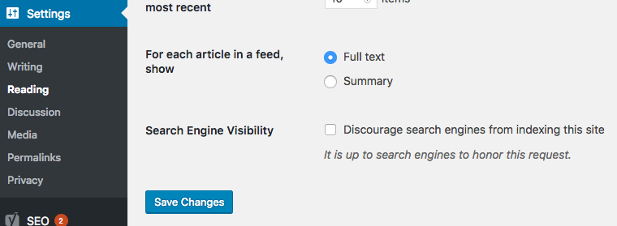

# allow-indexing

Ensure site is visible to everyone, including search engines and archivers.

## Install

This checkers comes with the [preflight-command](http://github.com/itinerisltd/preflight-command) package. No extra setup steps needed.

## Config

::: warning
Changing this checker's config doesn't make sense. Use with caution!
:::

```toml
# disable it
[allow-indexing]
enabled = false
```

## Fix



Uncheck **Discourage search engines from indexing this site**.
