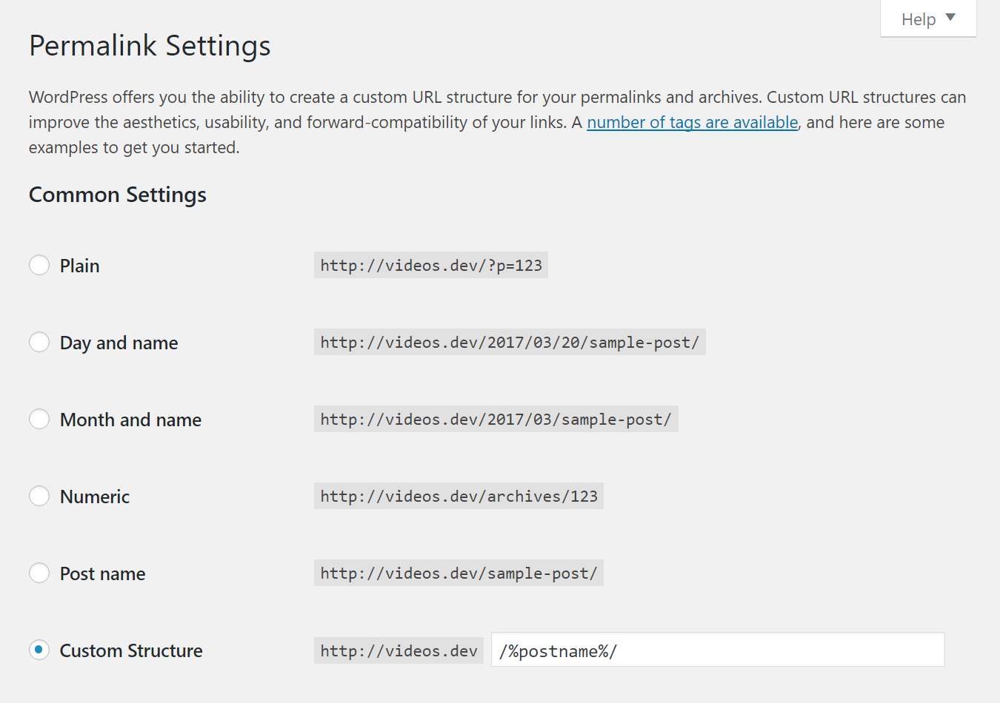

# pretty-permalinks

Ensure pretty permalinks is enabled.

## Install

This checkers comes with the [preflight-command](http://github.com/itinerisltd/preflight-command) package. No extra setup steps needed.

## Config

::: warning
Changing this checker's config doesn't make sense. Use with caution!
:::

```toml
# disable it
[pretty-permalinks]
enabled = false
```

## Solution

::: tip
You might need to change web server(Nginx / Apache) settings. See [WordPress Codex](https://codex.wordpress.org/Using_Permalinks)
:::



Use any option but **Plain**.
